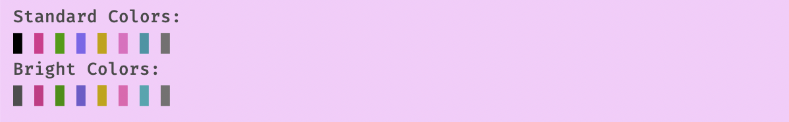
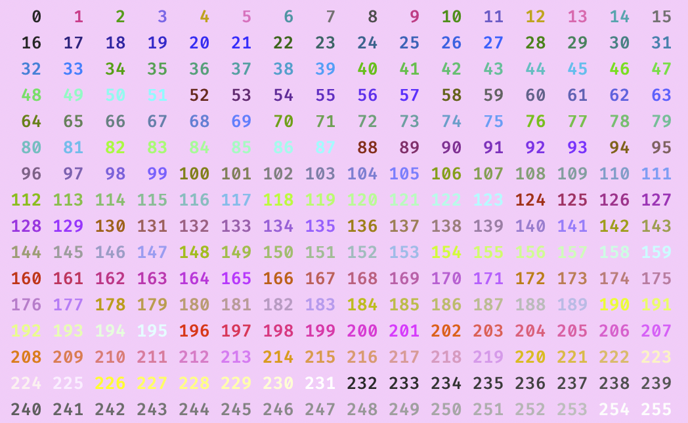

# 🍬 Pink Candy Terminal Theme

A soft pastel terminal theme designed to make your command-line interface feel light, friendly, and visually delightful.

## Features

* 🍓 **Pastel Pink Background**
* 🍇 **Smooth ANSI Color Palette**: Dreamy reds, blues, and greens with soft saturation.
* 🍬 **Minimal Contrast**: Comfortable on the eyes, perfect for long coding sessions.
* 🎀 **Cute Yet Functional**: Combines kawaii aesthetics with readability.

## Installation

1. Download `pink-candy.terminal`
2. Double-click the file — it will open in the macOS Terminal app.
3. Press `Cmd + S` to save the profile.
4. Set it as the default by going to:

   ```
   Terminal > Settings > Profiles > Pink Candy > Default
   ```

## Demo Script

Use the following to showcase the ANSI colors of this theme:

```sh
echo "Standard Colors:"
for i in {0..7}; do
    printf "\033[0;3%sm▉\033[0m " $i
done
echo

echo "Bright Colors:"
for i in {0..7}; do
    printf "\033[0;9%sm▉\033[0m " $i
done
echo

echo -e "\nText Styling:"
echo -e "\033[1mBold\033[0m \033[3mItalic\033[0m \033[4mUnderline\033[0m \033[9mStrikethrough\033[0m"
```

## Preview

The theme looks especially nice when paired with:

* Rosé Pine or Cotton Candy wallpapers
* Soft-themed VSCode or iTerm2 setups
* Pink cursor + transparency on

## Screenshots






## License

MIT © Jenna Studio
